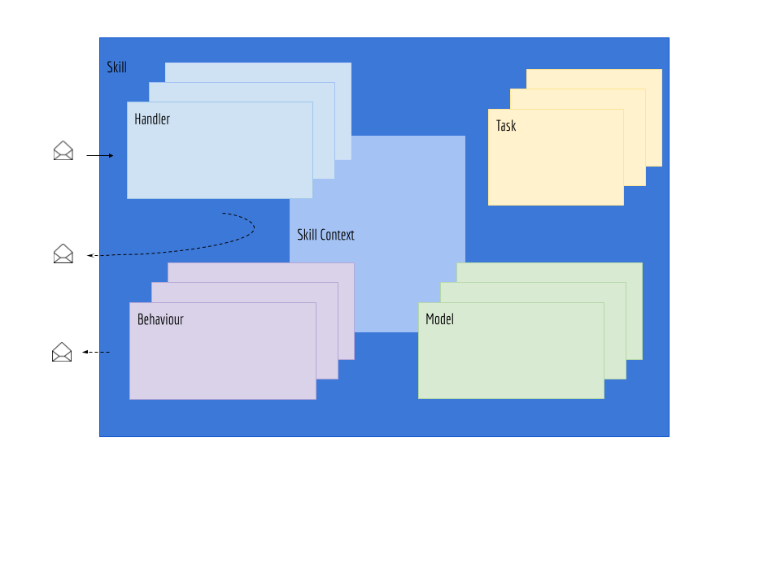

The AEA framework borrows several concepts from popular web frameworks like Django and Ruby on Rails.

## MVC

Both aforementioned web frameworks use the MVC (model-view-controller) architecture.

- Models: contain business logic and data representations
- View: contain the html templates
- Controller: deals with the request-response handling

## Comparison to AEA framework

The AEA framework is based on asynchronous messaging. Hence, there is not a direct 1-1 relationship between MVC based architectures and the AEA framework. Nevertheless, there are some parallels which can help a developer familiar with MVC make progress in the AEA framework in particular, the development of `Skills`, quickly:

- `Handler`: receive the messages for the protocol they are registered against and are supposed to handle these messages. They are the reactive parts of a skill and can be thought of as similar to the `Controller` in MVC. They can also send new messages.
- `Behaviour`: a behaviour encapsulates pro-active components of the agent. Since web apps do not have any goals or intentions they do not pro-actively pursue an objective. Therefore, there is no equivalent concept in MVC. Behaviours can but do not have to send messages.
- `Task`: are meant to deal with long running executions and can be thought of as the equivalent of background tasks in traditional web apps.
- `Model`: implement business logic and data representation, as such they are similar to the `Model` in MVC.

The `View` concept is probably best compared to the `Message` of a given `Protocol` in the AEA framework. Whilst views represent information to the client, messages represent information sent to other agents and services.

## Next steps

We recommend you continue with the next step in the 'Getting Started' series:

- <a href="../aea-vs-mvc/">Build a skill for an AEA</a>

 
