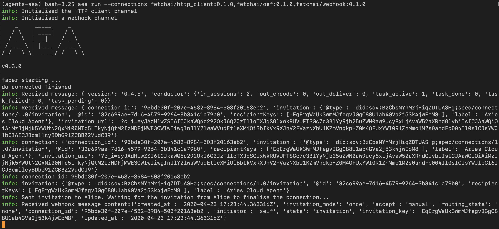
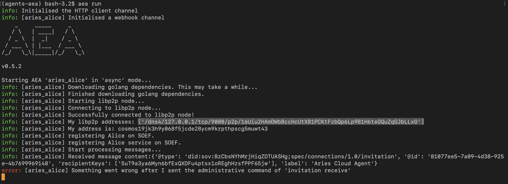

<div class="admonition note">
  <p class="admonition-title">Note</p>
  <p>This demo is incomplete and will soon be updated.
</p>
</div>

Demonstrating an entire decentralised identity scenario involving AEAs and instances of Aries Cloud Agents (ACAs).

## Discussion

This demo corresponds with the one <a href="https://github.com/hyperledger/aries-cloudagent-python/blob/master/demo/README.md" target=_blank>here</a> from <a href="https://github.com/hyperledger/aries-cloudagent-python" target=_blank> aries cloud agent repository </a>.

The aim of this demo is to illustrate how AEAs can connect to ACAs, thus gaining all of their capabilities, such as issuing and requesting verifiable credentials, selective disclosure and zero knowledge proofs. 

<div class="mermaid">
    sequenceDiagram
        participant faea as Faber_AEA
        participant faca as Faber_ACA
        participant aaca as Alice_ACA
        participant aaea as Alice_AEA
    
        activate faea
        activate faca
        activate aaca
        activate aaea
        
        Note right of aaea: Shows identity 
        
        faea->>faca: Request status?
        faca->>faea: status
        faea->>faca: create-invitation
        faca->>faea: connection inc. invitation
        faea->>aaea: invitation detail
        aaea->>aaca: receive-invitation
        
        deactivate faea
        deactivate faca
        deactivate aaca
        deactivate aaea
</div>

There are two AEAs: 

 * **Alice_AEA**
 * **Faber_AEA** 

and two ACAs:

 * **Alice_ACA**
 * **Faber_ACA**
 
Each AEA is connected to its corresponding ACA: **Alice_AEA** to **Alice_ACA** and **Faber_AEA** to **Faber_ACA**.

The following lists the sequence of interactions between the four agents:

 * **Alice_AEA**: starts
 * **Alice_AEA**: shows its identity in the terminal and waits for an `invitation` detail from **Faber_AEA**.
 * **Faber_AEA**: starts
 * **Faber_AEA**: tests its connection to **Faber_ACA**.
 * **Faber_ACA**: responds to **Faber_AEA**.
 * **Faber_AEA**: requests **Faber_ACA** to create an invitation.
 * **Faber_ACA**: responds by sending back the `connection` detail, which contains an `invitation` field.
 * **Faber_AEA**: sends the `invitation` detail to **Alice_AEA**.
 * **Alice_AEA**: receives `invitation` detail from **Faber_AEA**.
 * **Alice_AEA**: requests **Alice_ACA** to accept the invitation, by passing it the `invitation` detail it received in the last step.

All messages from an AEA to an ACA are http requests (using `http_client` connection).

All messages from an AEA to another AEA utilise the `oef` communication network accessed via the `oef` connection.

All messages initiated from an ACA to an AEA are webhooks (using `webhook` connection).

This is the extent of the demo, at this point. The rest of the interactions require an instance of the <a href="https://github.com/bcgov/von-network" target=_blank>Indy ledger</a> to run. This is what will be implemented next.

The rest of the interactions are broadly as follows:

 * **Alice_ACA**: accepts the invitation.
 * **Alice_ACA**: sends a matching invitation request to **Faber_ACA**.
 * **Faber_ACA**: accepts

At this point, the two ACAs are connected to each other. 

 * **Faber_AEA**: requests **Faber_ACA** to issue a credential (e.g. university degree) to **Alice_AEA**, which **Faber_ACA** does via **Alice_ACA**.
 * **Faber_AEA**: requests proof that **Alice_AEA**'s age is above 18.
 * **Alice_AEA**: presents proof that it's age is above 18, without presenting its credential.       

## Preparation Instructions

### Dependencies

Follow the <a href="../quickstart/#preliminaries">Preliminaries</a> and <a href="../quickstart/#installation">Installation</a> sections from the AEA quick start.

Install Aries cloud-agents (for more info see <a href="https://github.com/hyperledger/aries-cloudagent-python#install" target=_blank>here</a>) if you do not have it on your machine:

``` bash
pip install aries-cloudagent
```

### Terminals

Open four terminals. Each terminal will be used to run one of the four agents in this demo.

## Alice and Faber ACAs

To learn about the command for starting an ACA and its various options: 

``` bash
aca-py start --help
```

### Faber_ACA

In the first terminal:

``` bash
aca-py start --admin 127.0.0.1 8021 --admin-insecure-mode --inbound-transport http 0.0.0.0 8020 --outbound-transport http --webhook-url http://127.0.0.1:8022/webhooks
```

Make sure the ports above are unused.

Take note of the specific IP addresses and ports you used in the above command. We will refer to them by the following names: 

* **Faber admin IP**: 127.0.0.1
* **Faber admin port**: 8021
* **Faber webhook port**: 8022

The admin IP and port will be used to send administrative commands to this ACA from an AEA. 

The webhook port is where the ACA will send notifications to. We will expose this from the AEA so it receives this ACA's notifications.

### Alice_ACA

In the second terminal:

``` bash
aca-py start --admin 127.0.0.1 8031 --admin-insecure-mode --inbound-transport http 0.0.0.0 8030 --outbound-transp http --webhook-url http://127.0.0.1:8032/webhooks
```

Again, make sure the above ports are unused and take note of the specific IP addresses and ports. In this case:

* **Alice admin IP**: 127.0.0.1
* **Alice admin port**: 8031
* **Alice webhook port**: 8032

## Alice and Faber AEAs

Now you can create **Alice_AEA** and **Faber_AEA** in terminals 3 and 4 respectively.

There are two methods for creating each AEA, constructing it piece by piece, or fetching the whole agent project.

### Alice_AEA -- Method 1: Construct the Agent

In the third terminal, create **Alice_AEA** and move into its project folder: 

``` bash
aea create aries_alice
cd aries_alice
```

#### Add and Configure the Skill

Add the `aries_alice` skill:

``` bash
aea add skill fetchai/aries_alice:0.1.0
```

You now need to configure this skill to ensure `admin_host` and `admin_port` values in the skill's configuration file `alice/vendor/fetchai/skills/aries_alice/skill.yaml` match with the values you noted above for **Alice_ACA**.

You can use the framework's handy `config` <a href="../cli-commands">CLI command</a> to set these values:

``` bash
aea config set vendor.fetchai.skills.aries_alice.handlers.aries_demo_default.args.admin_host 127.0.0.1
```
``` bash
aea config set vendor.fetchai.skills.aries_alice.handlers.aries_demo_http.args.admin_host 127.0.0.1
```
``` bash
aea config set --type int vendor.fetchai.skills.aries_alice.handlers.aries_demo_default.args.admin_port 8031
```
``` bash
aea config set --type int vendor.fetchai.skills.aries_alice.handlers.aries_demo_http.args.admin_port 8031
```

#### Add and Configure the Connections

Add `http_client`, `oef` and `webhook` connections:

``` bash
aea add connection fetchai/http_client:0.2.0
aea add connection fetchai/webhook:0.1.0
aea add connection fetchai/oef:0.3.0
```

You now need to configure the `webhook` connection. 

First is ensuring the value of `webhook_port` in `webhook` connection's configuration file `alice/vendor/fetchai/connections/webhook/connection.yaml` matches with what you used above for **Alice_ACA**. 

``` bash
aea config set --type int vendor.fetchai.connections.webhook.config.webhook_port 8032
```

Next, make sure the value of `webhook_url_path` is `/webhooks/topic/{topic}/`.

``` bash
aea config set vendor.fetchai.connections.webhook.config.webhook_url_path /webhooks/topic/{topic}/
```

#### Configure Alice_AEA:

Now you must ensure **Alice_AEA**'s default connection is `oef`. 

``` bash
aea config set agent.default_connection fetchai/oef:0.3.0
```

### Alice_AEA -- Method 2: Fetch the Agent

Alternatively, in the third terminal, fetch **Alice_AEA** and move into its project folder: 

``` bash
aea fetch fetchai/aries_alice:0.2.0 
cd aries_alice
```

#### Configure the skill and connections:

You need to configure the `aries_alice` skill of the AEA to ensure `admin_host` and `admin_port` values in the skill's configuration file `alice/vendor/fetchai/skills/aries_alice/skill.yaml` match with the values you noted above for **Alice_ACA**.

You can use the framework's handy `config` <a href="../cli-commands">CLI command</a> to set these values:

``` bash
aea config set vendor.fetchai.skills.aries_alice.handlers.aries_demo_default.args.admin_host 127.0.0.1
```
``` bash
aea config set vendor.fetchai.skills.aries_alice.handlers.aries_demo_http.args.admin_host 127.0.0.1
```
``` bash
aea config set --type int vendor.fetchai.skills.aries_alice.handlers.aries_demo_default.args.admin_port 8031
```
``` bash
aea config set --type int vendor.fetchai.skills.aries_alice.handlers.aries_demo_http.args.admin_port 8031
```

You now need to configure the `webhook` connection. 

First is ensuring the value of `webhook_port` in `webhook` connection's configuration file `alice/vendor/fetchai/connections/webhook/connection.yaml` matches with what you used above for **Alice_ACA**. 

``` bash
aea config set --type int vendor.fetchai.connections.webhook.config.webhook_port 8032
```

Next, make sure the value of `webhook_url_path` is `/webhooks/topic/{topic}/`.

``` bash
aea config set vendor.fetchai.connections.webhook.config.webhook_url_path /webhooks/topic/{topic}/
```

### Install the Dependencies and Run Alice_AEA:

After creating **Alice_AEA** using either of the methods above, you must install all the dependencies:

``` bash
aea install
```

Finally run **Alice_AEA**:

``` bash
aea run
```

You should see **Alice_AEA** running and showing its identity on the terminal. For example:

``` bash
My address is: YrP7H2qdCb3VyPwpQa53o39cWCDHhVcjwCtJLes6HKWM8FpVK
```

Take note of this value. We will refer to this as **Alice_AEA's address**.

### Faber_AEA -- Method 1: Construct the Agent

In the fourth terminal, create **Faber_AEA** and move into its project folder: 

``` bash
aea create aries_faber
cd aries_faber
```

#### Add and Configure the Skill:

Add the `aries_faber` skill:

``` bash
aea add skill fetchai/aries_faber:0.1.0
```
You now need to configure this skill to ensure `admin_host` and `admin_port` values in the skill's configuration file `faber/vendor/fetchai/skills/aries_alice/skill.yaml` match with the values you noted above for **Faber_ACA**.

``` bash
aea config set vendor.fetchai.skills.aries_faber.behaviours.aries_demo_faber.args.admin_host 127.0.0.1
```

``` bash
aea config set vendor.fetchai.skills.aries_faber.handlers.aries_demo_http.args.admin_host 127.0.0.1
```

``` bash
aea config set --type int vendor.fetchai.skills.aries_faber.behaviours.aries_demo_faber.args.admin_port 8021
```

``` bash
aea config set --type int vendor.fetchai.skills.aries_faber.handlers.aries_demo_http.args.admin_port 8021
```

Additionally, make sure that the value of `alice_id` matches **Alice_AEA's address** as displayed in the third terminal.

``` bash
aea config set vendor.fetchai.skills.aries_faber.handlers.aries_demo_http.args.alice_id <Alice_AEA's address>
```

#### Add and Configure the Connections:

Add `http_client`, `oef` and `webhook` connections:

``` bash
aea add connection fetchai/http_client:0.2.0
aea add connection fetchai/webhook:0.1.0
aea add connection fetchai/oef:0.3.0
```

You now need to configure the `webhook` connection. 

First is ensuring the value of `webhook_port` in `webhook` connection's configuration file `faber/vendor/fetchai/connections/webhook/connection.yaml` matches with what you used above for **Faber_ACA**. 

``` bash
aea config set --type int vendor.fetchai.connections.webhook.config.webhook_port 8022
```

Next, make sure the value of `webhook_url_path` is `/webhooks/topic/{topic}/`.

``` bash
aea config set vendor.fetchai.connections.webhook.config.webhook_url_path /webhooks/topic/{topic}/
```

#### Configure Faber_AEA:

Now you must ensure **Faber_AEA**'s default connection is `http_client`.

``` bash
aea config set agent.default_connection fetchai/http_client:0.2.0
```

### Alice_AEA -- Method 2: Fetch the Agent

Alternatively, in the fourth terminal, fetch **Faber_AEA** and move into its project folder: 

``` bash
aea fetch fetchai/aries_faber:0.2.0 
cd aries_faber
```

#### Configure the skill and connections:

You need to configure the `aries_faber` skill of the AEA to ensure `admin_host` and `admin_port` values in the skill's configuration file `faber/vendor/fetchai/skills/aries_alice/skill.yaml` match with the values you noted above for **Faber_ACA**.

``` bash
aea config set vendor.fetchai.skills.aries_faber.behaviours.aries_demo_faber.args.admin_host 127.0.0.1
```

``` bash
aea config set vendor.fetchai.skills.aries_faber.handlers.aries_demo_http.args.admin_host 127.0.0.1
```

``` bash
aea config set --type int vendor.fetchai.skills.aries_faber.behaviours.aries_demo_faber.args.admin_port 8021
```

``` bash
aea config set --type int vendor.fetchai.skills.aries_faber.handlers.aries_demo_http.args.admin_port 8021
```

Additionally, make sure that the value of `alice_id` matches **Alice_AEA's address** as displayed in the third terminal.

``` bash
aea config set vendor.fetchai.skills.aries_faber.handlers.aries_demo_http.args.alice_id <Alice_AEA's address>
```

You now need to configure the `webhook` connection. 

First is ensuring the value of `webhook_port` in `webhook` connection's configuration file `faber/vendor/fetchai/connections/webhook/connection.yaml` matches with what you used above for **Faber_ACA**. 

``` bash
aea config set --type int vendor.fetchai.connections.webhook.config.webhook_port 8022
```

Next, make sure the value of `webhook_url_path` is `/webhooks/topic/{topic}/`.

``` bash
aea config set vendor.fetchai.connections.webhook.config.webhook_url_path /webhooks/topic/{topic}/
```

### Install the Dependencies and Run Faber_AEA:

After creating **Faber_AEA** using either of the methods above, you must install all the dependencies:

``` bash
aea install
```

Finally run **Faber_AEA**:

``` bash
aea run
```

You should see **Faber_AEA** running and showing logs of its activities. For example: 

<center></center>

Looking now at **Alice_AEA** terminal, you should also see more activity by **Alice_AEA** after **Faber_AEA** was started. For example:

<center></center>

The last error line in **Alice_AEA**'s terminal is caused due to the absence of an Indy ledger instance. In the next update to this demo, this will be resolved.

## Terminate and Delete the Agents

You can terminate each agent by pressing Ctrl+C. 

To delete the AEAs, go to the projects' parent directory and delete the AEAs:

``` bash
aea delete aries_faber
aea delete aries_alice
``` 

## Further developments

In the next update to this demo, the remaining interactions between AEAs and ACAs must be implemented. This means:

* An instance of Indy ledger must be installed and running. See <a href="https://github.com/bcgov/von-network#running-the-network-locally" target=_blank>here</a> for more detail.
* The commands for running the ACAs need to be adjusted. Additional options relating to a wallet (wallet-name, type, key, storage-type, config, creds) need to be fed to the ACAs as well as the ledger's genesis file so the ACAs can connect to the ledger.
* The remaining interactions between the AEAs and ACAs as described <a href="./#discussion">here</a> need to be implemented.     
