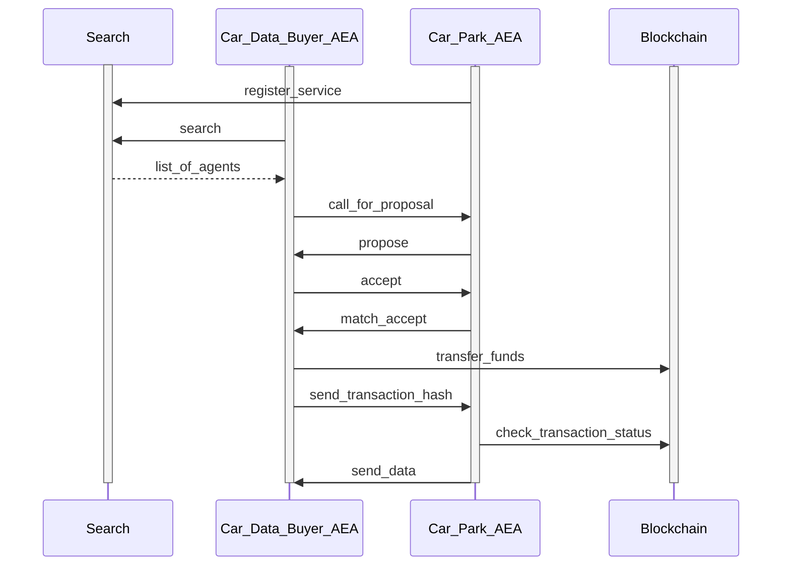
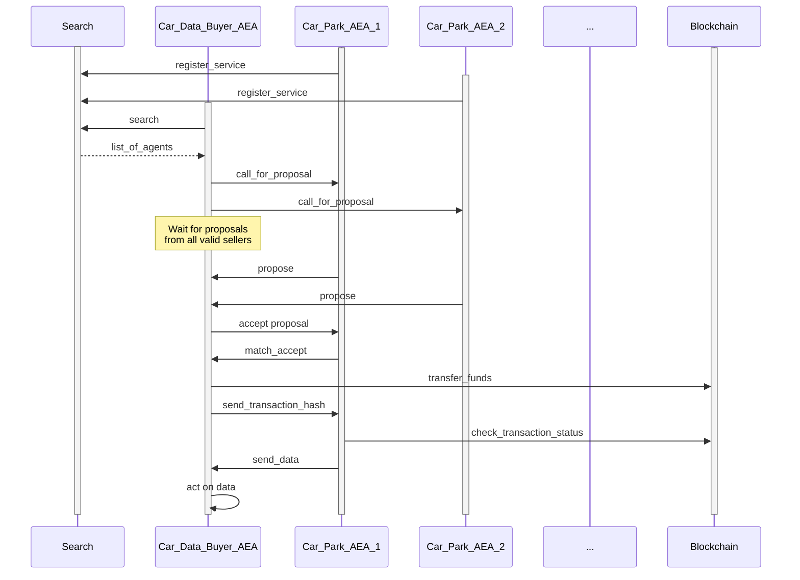

# Car park skills

The AEA car-park skills demonstrate an interaction between two AEAs.

- The `carpark_detection` AEA provides information on the number of car parking spaces available in a given vicinity.
- The `carpark_client` AEA is interested in purchasing information on available car parking spaces in the same vicinity.

## Discussion

The full Fetch.ai car park AEA demo is documented in its own repo <a href="https://github.com/fetchai/carpark_agent" target="_blank">here</a> but please be aware that the approach may not be up to date.
The demo displayed here allows you to test the AEA functionality of the car park AEA demo without the detection logic.

It demonstrates how the AEAs trade car park information.

## Communication

This diagram shows the communication between the various entities as data is successfully sold by the car park AEA to the client.



## Option 1: AEA Manager Approach

Follow this approach when using the AEA Manager Desktop app. Otherwise, skip and follow the CLI approach below.

### Preparation Instructions

Install the <a href="https://aea-manager.fetch.ai" target="_blank">AEA Manager</a>.

### Demo Instructions

The following steps assume you have launched the AEA Manager Desktop app.

1. Add a new AEA called `car_detector` with public id `fetchai/car_detector:0.32.5`.

2. Add another new AEA called `car_data_buyer` with public id `fetchai/car_data_buyer:0.33.5`.

3. Copy the address from the `car_data_buyer` into your clip board. Then go to the <a href="https://explore-dorado.fetch.ai" target="_blank">Dorado block explorer</a> and request some test tokens via `Get Funds`.

4. Run the `car_detector` AEA. Navigate to its logs and copy the multiaddress displayed.

5. Navigate to the settings of the `car_data_buyer` and under `components > connection >` `fetchai/p2p_libp2p:0.22.0` update as follows (make sure to replace the placeholder with the multiaddress):

    ``` bash
    {
      "delegate_uri": "127.0.0.1:11001",
      "entry_peers": ["REPLACE_WITH_MULTI_ADDRESS_HERE"],
      "local_uri": "127.0.0.1:9001",
      "log_file": "libp2p_node.log",
      "public_uri": "127.0.0.1:9001"
    }
    ```

6. Run the `car_data_buyer`.

In the AEA's logs, you should see the agent trading successfully.

## Option 2: CLI Approach

Follow this approach when using the `aea` CLI.

### Preparation Instructions

#### Dependencies

Follow the <a href="../quickstart/#preliminaries">Preliminaries</a> and <a href="../quickstart/#installation">Installation</a> sections from the AEA quick start.

### Demo Instructions

#### Create Car Detector AEA

First, fetch the car detector AEA:

``` bash
aea fetch fetchai/car_detector:0.32.5
cd car_detector
aea install
aea build
```

??? note "Alternatively, create from scratch:"

    The following steps create the car detector from scratch:

    ``` bash
    aea create car_detector
    cd car_detector
    aea add connection fetchai/p2p_libp2p:0.27.5
    aea add connection fetchai/soef:0.27.6
    aea add connection fetchai/ledger:0.21.5
    aea add skill fetchai/carpark_detection:0.27.6
    aea config set --type dict agent.dependencies \
    '{
      "aea-ledger-fetchai": {"version": "<2.0.0,>=1.0.0"}
    }'
    aea config set agent.default_connection fetchai/p2p_libp2p:0.27.5
    aea config set --type dict agent.default_routing \
    '{
      "fetchai/ledger_api:1.1.7": "fetchai/ledger:0.21.5",
      "fetchai/oef_search:1.1.7": "fetchai/soef:0.27.6"
    }'
    aea install
    aea build
    ```

#### Create Car Data Buyer AEA

Then, fetch the car data client AEA:

``` bash
aea fetch fetchai/car_data_buyer:0.33.5
cd car_data_buyer
aea install
aea build
```

??? note "Alternatively, create from scratch:"
    The following steps create the car data client from scratch:

    ``` bash
    aea create car_data_buyer
    cd car_data_buyer
    aea add connection fetchai/p2p_libp2p:0.27.5
    aea add connection fetchai/soef:0.27.6
    aea add connection fetchai/ledger:0.21.5
    aea add skill fetchai/carpark_client:0.28.0
    aea config set --type dict agent.dependencies \
    '{
      "aea-ledger-fetchai": {"version": "<2.0.0,>=1.0.0"}
    }'
    aea config set agent.default_connection fetchai/p2p_libp2p:0.27.5
    aea config set --type dict agent.default_routing \
    '{
      "fetchai/ledger_api:1.1.7": "fetchai/ledger:0.21.5",
      "fetchai/oef_search:1.1.7": "fetchai/soef:0.27.6"
    }'
    aea install
    aea build
    ```

#### Add Keys for the Car Data Seller AEA

First, create the private key for the car data seller AEA based on the network you want to transact. To generate and add a private-public key pair for Fetch.ai `Dorado` use:

``` bash
aea generate-key fetchai
aea add-key fetchai fetchai_private_key.txt
```

Next, create a private key used to secure the AEA's communications:

``` bash
aea generate-key fetchai fetchai_connection_private_key.txt
aea add-key fetchai fetchai_connection_private_key.txt --connection
```

Finally, certify the key for use by the connections that request that:

``` bash
aea issue-certificates
```

#### Add Keys and Generate Wealth for the Car Data Buyer AEA

The buyer needs to have some wealth to purchase the service from the seller.

First, create the private key for the car data buyer AEA based on the network you want to transact. To generate and add a private-public key pair for Fetch.ai `Dorado` use:

``` bash
aea generate-key fetchai
aea add-key fetchai fetchai_private_key.txt
```

Then, create some wealth for your car data buyer based on the network you want to transact with. On the Fetch.ai `Dorado` network:

``` bash
aea generate-wealth fetchai
```

Next, create a private key used to secure the AEA's communications:

``` bash
aea generate-key fetchai fetchai_connection_private_key.txt
aea add-key fetchai fetchai_connection_private_key.txt --connection
```

Finally, certify the key for use by the connections that request that:

``` bash
aea issue-certificates
```

### Run the AEAs

Run both AEAs from their respective terminals.

First, run the car data seller AEA:

``` bash
aea run
```

Once you see a message of the form `To join its network use multiaddr 'SOME_ADDRESS'` take note of the address. (Alternatively, use `aea get-multiaddress fetchai -c -i fetchai/p2p_libp2p:0.27.5 -u public_uri` to retrieve the address.)
This is the entry peer address for the local <a href="../acn">agent communication network</a> created by the car data seller.

Then, in the car data buyer, run this command (replace `SOME_ADDRESS` with the correct value as described above):

``` bash
aea config set --type dict vendor.fetchai.connections.p2p_libp2p.config \
'{
  "delegate_uri": "127.0.0.1:11001",
  "entry_peers": ["SOME_ADDRESS"],
  "local_uri": "127.0.0.1:9001",
  "log_file": "libp2p_node.log",
  "public_uri": "127.0.0.1:9001"
}'
```

This allows the car data buyer to connect to the same local agent communication network as the car data seller.

Then run the buyer AEA:

``` bash
aea run
```

You will see that the AEAs negotiate and then transact using the Fetch.ai testnet.

#### Cleaning up

When you're finished, delete your AEAs:

``` bash
cd ..
aea delete car_detector
aea delete car_data_buyer
```

## Extension #1:
**1 carpark_client AEA <-> n carpark_detection AEAs**
In this scenario we add an arbitrary amount of carpark_detection AEAs to simulate a situation where a car in the city is querying multiple carparks to check for free parking spots.

**Note:** This simply demonstrates the agents capability to query the sOEF for multiple counterparties, sending each a CFP and picking one based on configuration or application logic.
Currently this is being done by choosing the cheapest service provider available.

Possible next steps could include:
- Check the next carpark if the cheapest carpark that was queried has no free spots available
- Book or reserve a spot to reduce the number of available parking spots for a certain amount of time
- Feed the availability data into your own prediction model for future parking

### Summary / Layout
- have (at least) 2 carpark_detection AEAs
- configure each to have different `location` & `price` and `entry points / IPs`
- have 1 carpark_client AEA
- configure `entry point / IP` to be able to connect to the other AEAs
- optional: modify configuration to impact buying behaviour

### Communication
This diagram shows the communication between the various entities as data is successfully sold by one of the car park AEAs to the client.



### Demo Instructions
#### Preparation Instructions
This approach concentrates on using the `aea` CLI and is very similar to the installation process mentioned above.

#### Dependencies

Follow the <a href="../quickstart/#preliminaries">Preliminaries</a> and <a href="../quickstart/#installation">Installation</a> sections from the AEA quick start.

#### Create Car Detector AEAs

Fetch the car detector AEAs and give them an alias to make them unique.

``` bash
aea fetch fetchai/car_detector:0.32.5 --alias car_detector_one
cd car_detector_one
aea install
aea build
cd ..
aea fetch fetchai/car_detector:0.32.5 --alias car_detector_two
cd car_detector_two
aea install
aea build
[...]
```

??? note "Alternatively, create from scratch:"
    In a separate terminal, in the root directory, create at least two car detector AEAs:

    Build the first car detector AEA (including the certification for AEA communication):
    ``` bash
    aea create car_detector_1 && cd car_detector_1
    aea add connection fetchai/p2p_libp2p:0.27.5
    aea add connection fetchai/soef:0.27.6
    aea add connection fetchai/ledger:0.21.5
    aea add skill fetchai/carpark_detection:0.27.6
    aea config set --type dict agent.dependencies \
    '{
      "aea-ledger-fetchai": {"version": "<2.0.0,>=1.0.0"}
    }'
    aea config set agent.default_connection fetchai/p2p_libp2p:0.27.5
    aea config set --type dict agent.default_routing \
    '{
      "fetchai/ledger_api:1.1.7": "fetchai/ledger:0.21.5",
      "fetchai/oef_search:1.1.7": "fetchai/soef:0.27.6"
    }'
    aea install
    aea build
    cd ..
    ```

    After that, build the next AEA:
    ``` bash
    cd ..
    aea create car_detector_2 && cd car_detector_2
    aea add connection fetchai/p2p_libp2p:0.27.5
    aea add connection fetchai/soef:0.27.6
    aea add connection fetchai/ledger:0.21.5
    aea add skill fetchai/carpark_detection:0.27.6
    aea config set --type dict agent.dependencies \
    '{
      "aea-ledger-fetchai": {"version": "<2.0.0,>=1.0.0"}
    }'
    aea config set agent.default_connection fetchai/p2p_libp2p:0.27.5
    aea config set --type dict agent.default_routing \
    '{
      "fetchai/ledger_api:1.1.7": "fetchai/ledger:0.21.5",
      "fetchai/oef_search:1.1.7": "fetchai/soef:0.27.6"
    }'
    aea install
    aea build
    ```

#### Create Car Data Buyer AEA
Fetch the car data client AEA:
``` bash
aea fetch fetchai/car_data_buyer:0.33.5
cd car_data_buyer
aea install
aea build
```

??? note "Alternatively, create from scratch:"
    The following steps create the car data client from scratch and:

    ``` bash
    aea create car_data_buyer && cd car_data_buyer
    aea add connection fetchai/p2p_libp2p:0.27.5
    aea add connection fetchai/soef:0.27.6
    aea add connection fetchai/ledger:0.21.5
    aea add skill fetchai/carpark_client:0.28.0
    aea config set --type dict agent.dependencies \
    '{
      "aea-ledger-fetchai": {"version": "<2.0.0,>=1.0.0"}
    }'
    aea config set agent.default_connection fetchai/p2p_libp2p:0.27.5
    aea config set --type dict agent.default_routing \
    '{
      "fetchai/ledger_api:1.1.7": "fetchai/ledger:0.21.5",
      "fetchai/oef_search:1.1.7": "fetchai/soef:0.27.6"
    }'
    aea install
    aea build
    ```

#### Add Keys for the Car Data Seller AEAs
At this point you want to provide your AEAs with the means to communicate with each other so you need to essentially create a public-private key pair to each for authentication on the Fetch.ai `Dorado` network.

**Note:** If you want your agents to communicate on a different network you have to adapt the configuration first.

``` bash
cd <insert_your_car_seller_agent_directory_here>
aea generate-key fetchai
aea add-key fetchai fetchai_private_key.txt
```

Next, create a private key to secure the AEA's communications:

``` bash
aea generate-key fetchai fetchai_connection_private_key.txt
aea add-key fetchai fetchai_connection_private_key.txt --connection
```

Finally, issue the certificates necessary for the connections:

``` bash
aea issue-certificates
```

#### Add Keys and Generate Wealth for the Car Data Buyer AEA
The buyer also needs certificates to communicate but more importantly it needs some wealth to purchase the services from the sellers.

First, create the private key for the car data buyer AEA based on the network you want to transact. To generate and add a public-private key pair for Fetch.ai `Dorado` use:

``` bash
cd <insert_your_car_seller_agent_directory_here>
aea generate-key fetchai
aea add-key fetchai fetchai_private_key.txt
```

Then, create some wealth for your car data buyer based on the network you want to transact with.

**Note:** The `generate-wealth` command utilises the faucet functionality of the Fetch.ai testnet to provide tokens to a wallet. If you were to use the AEAs on another network you would need to transfer tokens via smart contract or other means instead.

``` bash
aea generate-wealth fetchai
```

Next, create a private key to secure the AEA's communications:

``` bash
aea generate-key fetchai fetchai_connection_private_key.txt
aea add-key fetchai fetchai_connection_private_key.txt --connection
```

Finally, issue the certificates necessary for the connections:

``` bash
aea issue-certificates
```

#### Run the AEAs
In this step we run all AEAs but for them to be able to communicate we need to set a common namespace, i.e. have a local ACN set up with one AEA and give the other for all AEAs the address as an entry point to find each other.

First, run one of the car data seller AEAs:

``` bash
aea run
```

Once you see a message of the form `To join its network use multiaddr 'SOME_ADDRESS'` take note of the address. (Alternatively, use `aea get-multiaddress fetchai -c -i fetchai/p2p_libp2p:0.27.5 -u public_uri` to retrieve the address.)
This is the entry peer address for the local <a href="../acn">agent communication network (ACN)</a> created by one of the car data sellers.

Then, in the car data buyer and the other sellers, run this command (replace `SOME_ADDRESS` with the correct value as described above AND change the ports of the agents to be unique, e.g. `9001`, `9002`, etc. ):

``` bash
aea config set --type dict vendor.fetchai.connections.p2p_libp2p.config \
'{
  "delegate_uri": "127.0.0.1:11001",
  "entry_peers": ["SOME_ADDRESS"],
  "local_uri": "127.0.0.1:9001",
  "log_file": "libp2p_node.log",
  "public_uri": "127.0.0.1:9001"
}'
```

This allows all AEAs to connect to the same local agent communication network.

Then run the other AEAs in separate terminals but remember to run the buyer last to see the negotiation and transaction:

``` bash
aea run
```

You will see that the AEAs negotiate and then transact using the Fetch.ai testnet.

#### Cleaning up

When you're finished, delete your AEAs:

First `cd ..` out to the parent directory and then `aea delete <your_agent_name>` each of the AEAs that you created for this demo.

## Extension #2:
**n carpark_client AEAs <-> n carpark_detection AEAs**
In this scenario we add an arbitrary amount of carpark_client AEAs to simulate a situation where multiple cars in the city are querying multiple carparks to check for free parking spots.

**Note:** This again only demonstrates the agents capability to query the sOEF for multiple counterparties, sending each a CFP and picking one based on configuration or application logic.
This scenario will lay the foundation for most decentralised `n:n` communication setups and should be seen as just that.

Possible next steps could include:
- Check the next carpark if the cheapest carpark that was queried has no free spots available
- Book or reserve a spot to reduce the number of available parking spots for a certain amount of time
- Feed the availability data into your own prediction model for future parking

### Summary / Layout
- have (at least) 2 carpark_detection AEAs
- configure each to have different `location` & `price` and `entry points / IPs`
- have (at least) 2 carpark_client AEAs
- configure each to also have different `entry point / IP` to be able to connect to the other AEAs
- *optional: modify configuration to impact buying behaviour*

### Communication
The communication is similar to the one in Extension#1 so there is no different figure shown here.

### Demo instructions
At this point it is assumed that you did all of the above steps from Extension #1 and successfully set up one (1) car_data_buyer AEA and multiple (>=2) car_detector AEAs.

**Steps:**
- Add at least one other car_data_buyer AEA and give it a unique `name` and `entry point / IP`
- Now change the configuration of both car_data_buyer AEAs to continue searching for spots even if they found one (`stop_searching_on_result` to `false`) and change the `max_negotiations` and `max_unit_price` to some other values to see how it affects the AEAs behaviour

``` bash
cd <your_car_buyer_aea_directory>
aea config set --type dict vendor.fetchai.skills.carpark_client.models.strategy.args \
'{
  "max_negotiations": 5
  "max_unit_price": 20
  "stop_searching_on_result": false
}'
```
