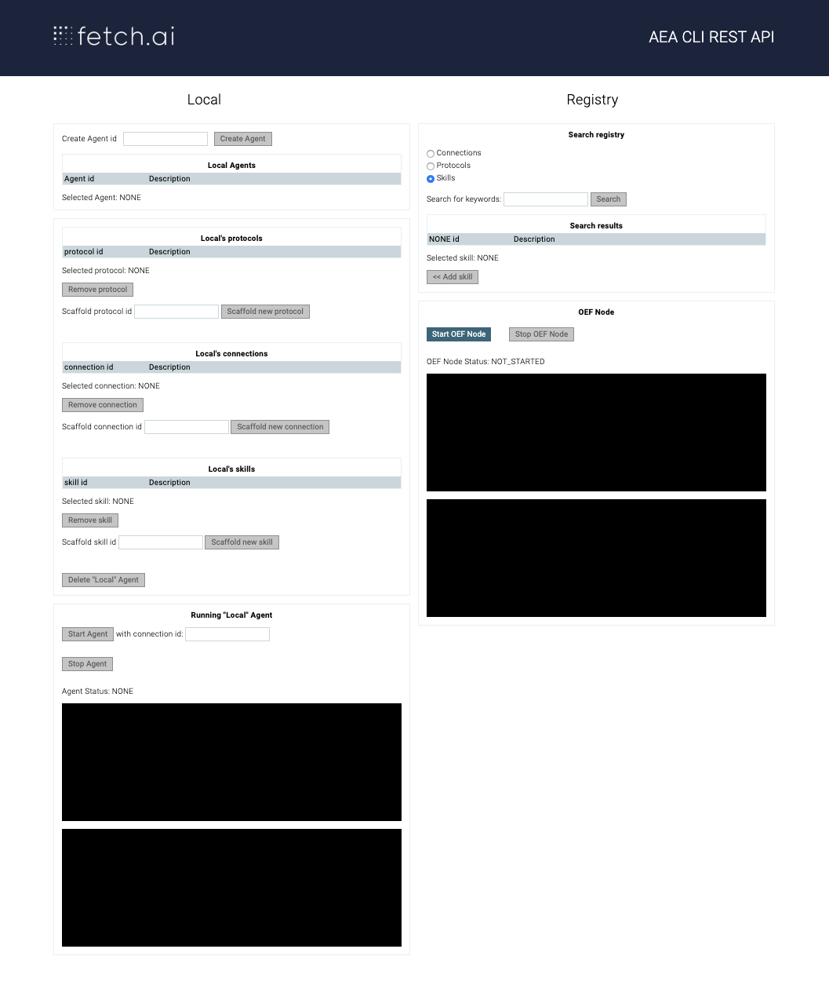
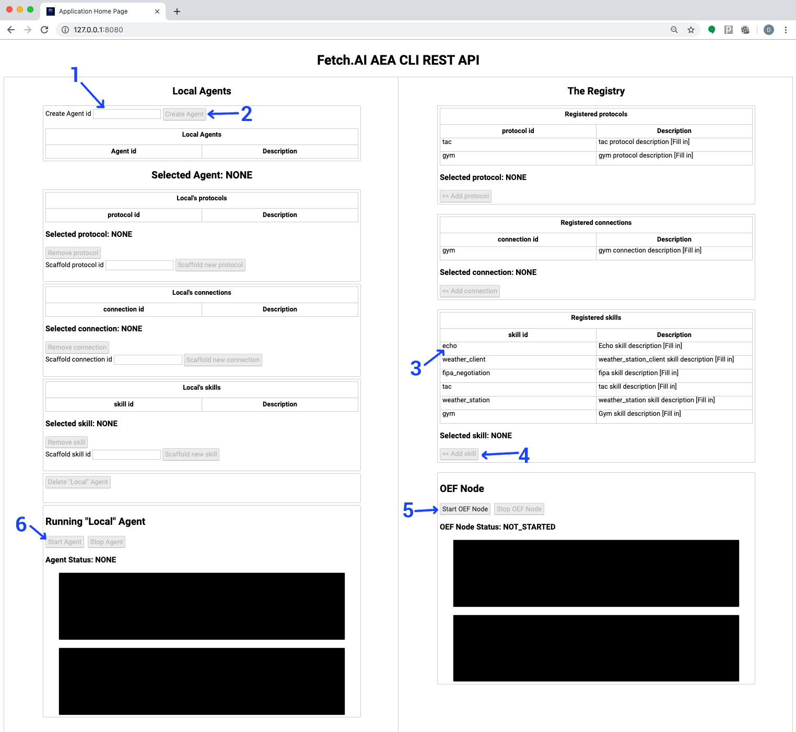
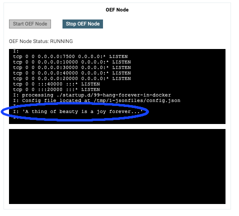
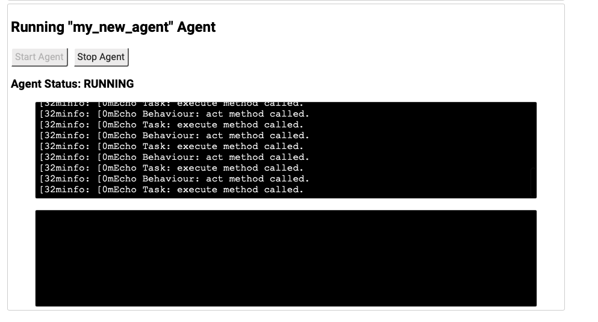
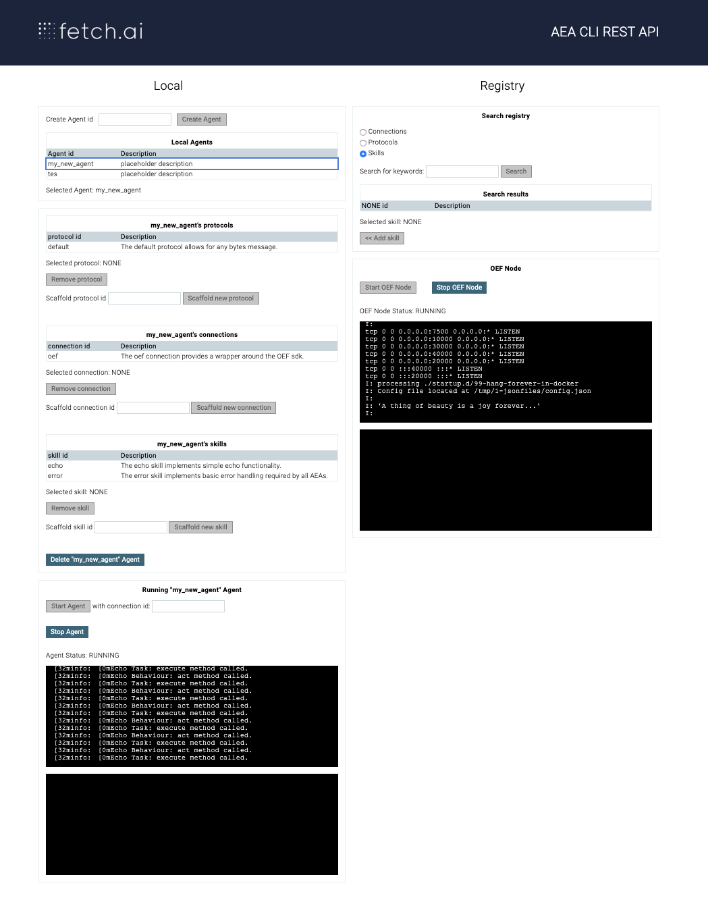

You can invoke the AEA Command Line Interface (CLI) from a Graphical User Interface (GUI) accessed from a web browser. 

These instructions will take you through building an agent, starting an OEF Node, and running the agent - all from the GUI. 

## Preliminaries

Follow the Preliminaries and Installation instructions <a href="../quickstart" target=_blank>here</a>.

Install the extra dependencies for the CLI GUI.

```python
pip install aea[cli_gui]
```


## Starting the GUI
Go to the directory in which you will create new agents. If you followed the quick start guide, this will be `my_aea`. 

Start the local web-server.
``` bash
aea gui
```
Open this page in a browser: [http://127.0.0.1:8080](http://127.0.0.1:8080)

You should see the following page.

<center></center>

On the left-hand side we can see any agents you have created and the protocols, connections, and skills they have. Initially this will be empty - unless you have run the quick start previously and not deleted those agents.

On the right-hand side is the Registry which shows all the protocols, connections, and skills which are available to your agent.

To create a new agent and run it, follow these steps.
<center></center>

1. In the [Create Agent id] box on the left. type the name of your agent - e.g. my_new_agent. This should now be the currently selected agent - but you can click on its name in the list to make sure. 
2. Click the [Create Agent] button - the newly created agent should appear in the [Local Agents] table.
3. On the right hand side, find the Echo skill and click on it - this will select it.
4. Click on the [Add skill] button - which should now say "Add echo skill to my_new_agent agent".
5. Start an OEF Node by clicking on the [Start OEF Node] button. Wait for the text saying "A thing of beauty is a joy forever..." to appear. When you see that, the node has started successfully.

<center></center>

6. Start the agent running by clicking on the [start agent] button. You should see the output from the echo agent appearing on the screen.

<center></center>

This is how your whole page should look if you followed the instructions correctly.

<center></center>
 

<br />
