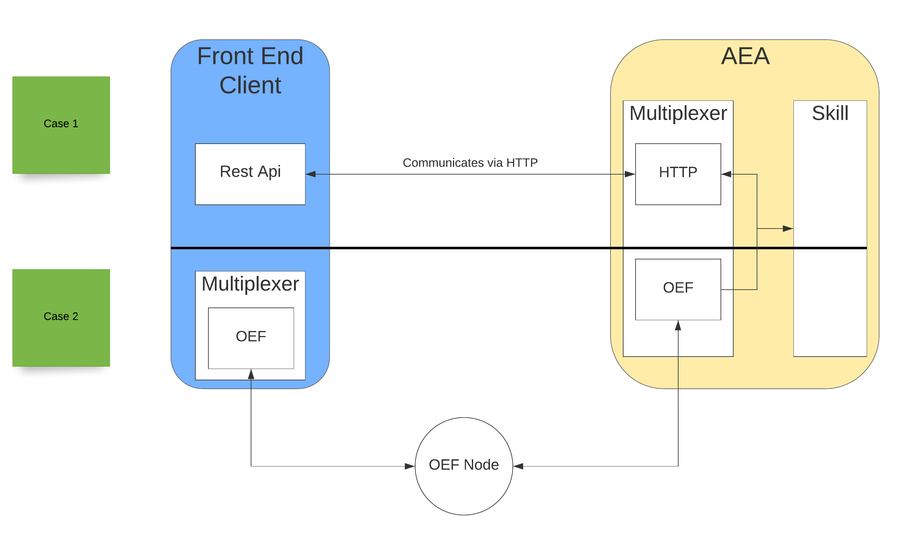

This demo will discuss the options we have to connect a frontend to the AEA. The following diagram illustrates 
the two options we are going to discuss.

 

## Case 1
The first option we have is to create a `Connection` that will handle the incoming requests from the rest API. In this scenario,
the rest API communicates with the AEA and requests are handled by the HTTP Connection package. 
The rest API should send CRUD requests to the `HTTP` Connection which translates these into Envelopes to be consumed by the correct skill.

## Case 2
The other option would be to create a stand-alone `Multiplexer` with an `OEF` connection. In this scenario, the frontend needs to incorporate a Multiplexer with an `OEF` connection. 
Then the [OEF communication node](../oef-ledger) can be used to send envelopes from the AEA to the frontend.

## Conclusion

The major difference between these two approaches is that in the first case we should know the IP of the AEA to be able to communicate. 
In case 2 though, the whole communication is handled by the [OEF communication node](../oef-ledger).

