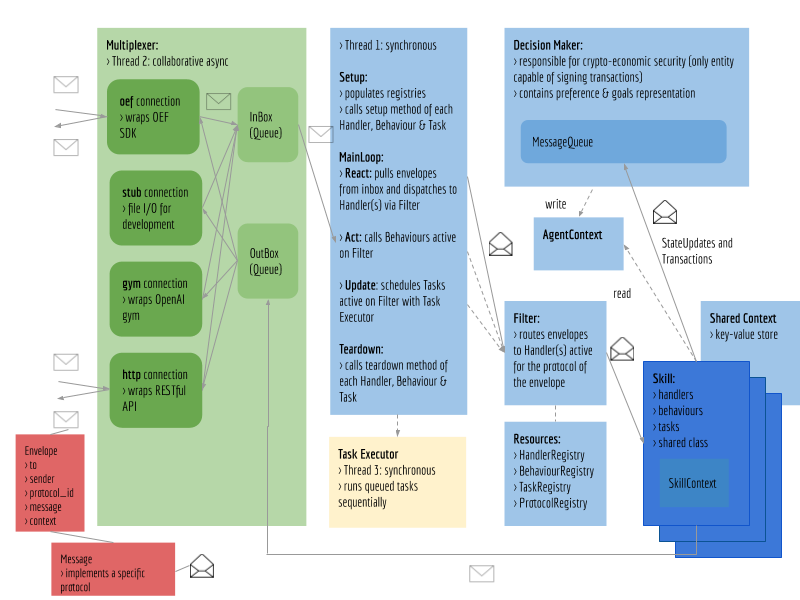

!!!	Note
	Work in progress.

The framework has two distinctive parts.

* A **core** that is developed by the Fetch.ai team as well as external contributors.
* **extensions** (also known as **packages**) developed by any developer which promotes a modular and scalable framework. 

Currently, the framework supports three types of packages which can be added to the core as modules.

* Skills
* Protocols
* Connections

The following figure illustrates the framework's architecture. 

 