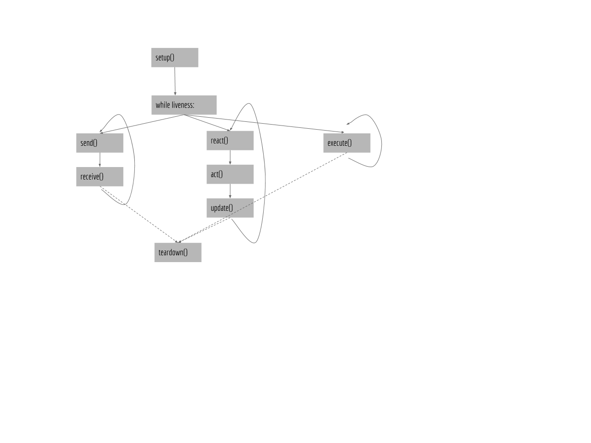

  
Note

  
Work in progress.

The framework has two distinctive parts.

-   A **core** that is developed by the Fetch.ai team as well as external contributors.
-   **Extensions** (also known as **packages**) developed by any developer which promotes a modular and scalable framework.

Currently, the framework supports three types of packages which can be added to the core as modules:

-   Skills
-   Protocols
-   Connections

The following figure illustrates the framework's architecture:

In most cases, as a developer in the AEA framework, it is sufficient to focus on skills development, utilising existing protocols and connections. 
The later doesn't try to discourage you though, from creating your own `connections` or `protocols` but you will need a better understanding of the framework than creating a skill.

The agent operation breaks down into three parts:

* Setup: calls the `setup()` method of all registered resources
* Operation:
    * Main loop (Thread 1 - Synchronous):
        * `react()`: this function grabs all Envelopes waiting in the `InBox` queue and calls the `handle()` function on the Handler(s) responsible for them.
        * `act()`: this function calls the `act()` function of all registered Behaviours.
        * `update()`: this function enqueues scheduled tasks for execution with the TaskManager.
    * Task loop (Thread 2- Synchronous): executes available tasks
    * Decision maker loop (Thread 3- Synchronous): processes internal messages
    * Multiplexer (Thread 4 - Asynchronous event loop): the multiplexer has an event loop which processes incoming and outgoing messages across several connections asynchronously.
* Teardown: calls the `teardown()` method of all registered resources

 