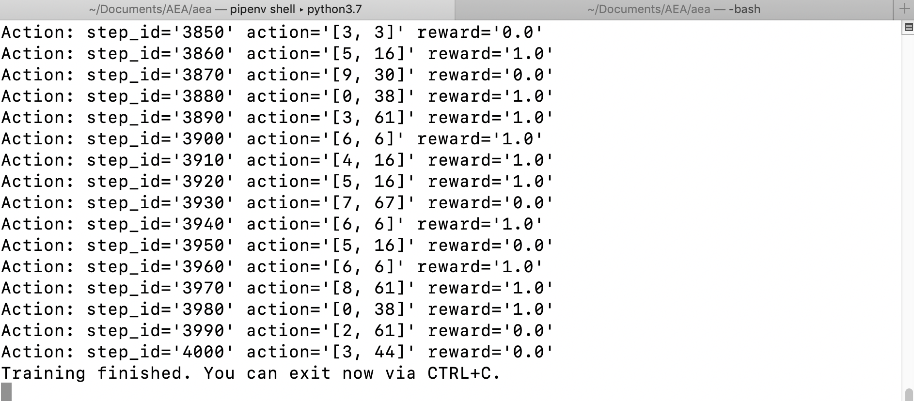

The AEA gym skill demonstrates how a custom Reinforcement Learning agent may be embedded into an Autonomous Economic Agent.


## Demo instructions

Follow the Preliminaries and Installation instructions <a href="../quickstart" target=_blank>here</a>.

Install the gym library.

``` bash
pip install gym
```

Then, download the examples and packages directory.
``` bash
svn export https://github.com/fetchai/agents-aea.git/trunk/examples
svn export https://github.com/fetchai/agents-aea.git/trunk/packages
```


### Create the agent
In the root directory, create the gym agent.
``` bash
aea create my_gym_agent
```


### Add the gym skill 
``` bash
cd my_gym_agent
aea add skill gym 
```


### Copy the gym environment to the agent directory
``` bash
mkdir gyms
cp -a ../examples/gym_ex/gyms/. gyms/
```


### Add a gym connection
``` bash
aea add connection gym
```


### Update the connection config
``` bash
nano connections/gym/connection.yaml
env: gyms.env.BanditNArmedRandom
```


### Run the agent with the gym connection

``` bash
aea run --connection gym
```

You will see the gym training logs.


<center></center>


### Delete the agent

When you're done, you can go up a level and delete the agent.

``` bash
aea delete my_gym_agent
```


<br/>