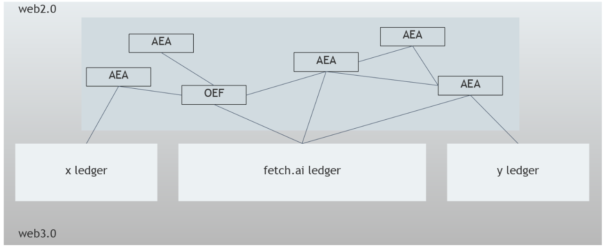

The Open Economic Framework (OEF) and Decentralized Ledger Technologies (DLTs) allow AEAs to create value through their interaction with other AEAs. The following diagram illustrates the relation of AEAs to the OEF and DLTs.

<center></center>

## Open Economic Framework (OEF)

The 'Open Economic Framework' (OEF) consists of protocols, languages and market mechanisms agents use to search and find each other, communicate with as well as trade with each other.

<div class="admonition note">
  <p class="admonition-title">Note</p>
  <p>The OEF is under development. Expect frequent changes. What follows is a description of the current implementation.</p>
</div>

At present, the OEF's capabilities are fulfilled by two components:

- a permissionless, public peer to peer (agent to agent) communication network, called the Agent Communication Network; and
- a centralized search and discovery system.

The latter will be decentralized over time.

### Agent Communication Network (ACN)

The agent communication network is a peer-to-peer communication network for agents. It allows agents, in particular AEAs, to send and receive envelopes between each other.

The implementation builds on the open-source <a href="https://libp2p.io/" target="_blank">libp2p</a> library. A distributed hash table is used by all participating peers to maintain a mapping between agents' cryptographic addresses and their network addresses.

Agents can receive messages from other agents if they are both connected to the ACN (see <a href="../p2p-connection">here</a>).

### Centralized search and discovery

A `simple OEF search node` allows agents to search and discover each other. In particular, agents can register themselves and their services as well as send search requests.

For two agents to be able to find each other, at least one must register as a service and the other must query the `simple OEF search node` for this service.

### Deprecated alternative (for local development only)

<details><summary>Click here for a local development alternative.</summary>
<p>

For local development, you can use an `OEF search and communication node`. This node consists of two parts. A `search node` part enables agents to register their services and search and discover other agents' services. A `communication node` part enables agents to communicate with each other.

For two agents to be able to find each other, at least one must register as a service and the other must query the `OEF search node` for this service. For an example of such an interaction see <a href="../skill-guide" target="_blank">this guide</a>.

Agents can receive messages from other agents if they are both connected to the same `OEF communication node`.

Currently, you need to run your own `OEF search and communication node` for local development and testing. To start an `OEF search and communication node` follow the <a href="../quickstart/#preliminaries">Preliminaries</a> sections from the AEA quick start. Then run:

``` bash
python scripts/oef/launch.py -c ./scripts/oef/launch_config.json
```

When it is live you will see the sentence 'A thing of beauty is a joy forever...'.

To view the `OEF search and communication node` logs for debugging, navigate to `data/oef-logs`.

To connect to an `OEF search and communication node` an AEA uses the `OEFConnection` connection package (`fetchai/oef:0.4.0`).

If you experience any problems launching the `OEF search and communication node` then consult [this](https://docs.google.com/document/d/1x_hFwEIXHlr_JCkuIv-izxSz0tN-7kSmSc-g32ImL1U/edit?usp=sharing) guide.

</p>
</details>

## Ledgers

Ledgers enable the AEAs to complete a transaction, which can involve the transfer of funds to each other or the execution of smart contracts.

Whilst a ledger can, in principle, also be used to store structured data - for instance, training data in a machine learning model - in most use cases the resulting costs and privacy implications do not make this a relevant use of the ledger. Instead, usually only references to the structured data - often in the form of hashes - are stored on the ledger and the actual data is stored off-chain.

The Python version of the AEA Framework currently integrates with three ledgers:

- [Fetch.ai ledger](https://docs.fetch.ai/ledger/)
- [Ethereum ledger](https://ethereum.org/build/)
- [Cosmos ledger](https://cosmos.network/sdk)
