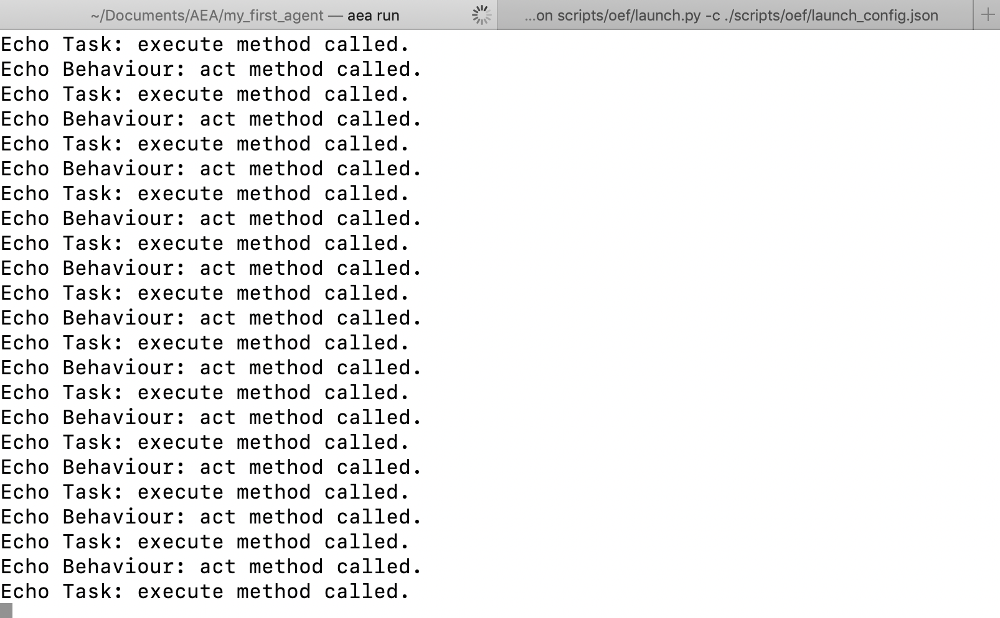

## Preliminaries

Make sure you are running desktop <a href="https://docs.docker.com/install/" target=_blank>Docker</a> and <a href="https://docs.docker.com/compose/install/" target=_blank>Docker Compose</a>.

Create and cd into a new working directory.

``` bash
mkdir aea/
cd aea/
```

Check you have `pipenv`.

``` bash
which pipenv
```

If you don't have it, install it. Instructions are <a href="https://pypi.org/project/pipenv/" target=_blank>here</a>.

Once installed, create a new environment and open it.

``` bash
touch Pipfile && pipenv --python 3.7 && pipenv shell
```


## Installation

Install the Autonomous Economic Agent framework.

The following installs the basic application without the cli. If in doubt, install `aea[all]`.
``` bash
pip install aea
```

The following installs the whole package.
``` bash
pip install aea[all]

```

The following only installs the cli.
``` bash
pip install aea[cli]
```


## Echo Agent demo
### Download the examples, scripts, and packages directories.
``` bash
svn export https://github.com/fetchai/agents-aea.git/trunk/scripts
svn export https://github.com/fetchai/agents-aea.git/trunk/packages
```

### Create a new agent
``` bash
aea create my_first_agent
```

### Add the echo skill 

``` bash
cd my_first_agent
aea add skill echo
```

### Launch the OEF 


Open a new terminal and launch the OEF.

``` bash
python scripts/oef/launch.py -c ./scripts/oef/launch_config.json
```

### Run the agent locally

Go back to the other terminal and run the agent.

``` bash
aea run
```

You will see the echo task running in the terminal window.

<center></center>


### Delete the agent

When you're done, you can delete the agent.

``` bash
aea delete my_first_agent
```


<br />
