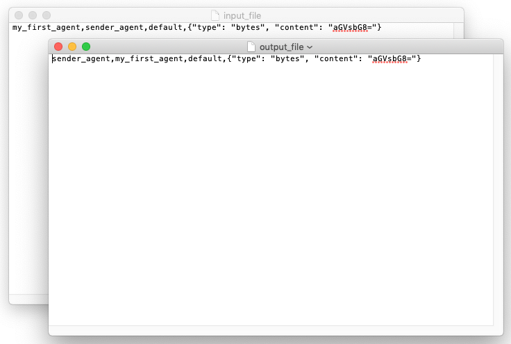

## Preliminaries

Create and enter into a new working directory.

``` bash
mkdir my_aea/
cd my_aea/
```

We highly recommend using a virtual environment to ensure consistency across dependencies.

Check that you have [`pipenv`](https://github.com/pypa/pipenv).

``` bash
which pipenv
```

If you don't have it, install it. Instructions are <a href="https://pypi.org/project/pipenv/" target=_blank>here</a>.

Once installed, create a new environment and open it.

``` bash
touch Pipfile && pipenv --python 3.7 && pipenv shell
```

### Installing docker

At some point, you will need [Docker](https://www.docker.com/) installed on your machine 
(e.g. to run an OEF Node).
 
If you don't have it, please check the official documentation [here](https://docs.docker.com/install/) 
and follow the instructions for your platform.


### Download the scripts and packages directories

Download folders containing examples, scripts and packages:
``` bash
svn export https://github.com/fetchai/agents-aea.git/trunk/examples
svn export https://github.com/fetchai/agents-aea.git/trunk/scripts
svn export https://github.com/fetchai/agents-aea.git/trunk/packages
```
You can install the `svn` command with (`brew install subversion` or `sudo apt-get install subversion`).


## Installation

The following installs the entire AEA package which also includes a command-line interface (CLI).

``` bash
pip install aea[all]
```

However, you can run this demo by installing the base AEA, including the CLI extension, alone.

``` bash
pip install aea[cli]
```


### Known issues

If the installation steps fail, it might be a dependency issue. 

The following hints can help:

- Ubuntu/Debian systems only: install Python 3.7 headers.
```bash
sudo apt-get install python3.7-dev
``` 

- Windows users: install <a href="https://visualstudio.microsoft.com/downloads/#build-tools-for-visual-studio-2019" target=_blank>tools for Visual Studio</a>. 


## Echo skill demo

The echo skill is a simple demo that introduces you to the main business logic components of an AEA.

## Option 1 - Step-by-step

### Create a new agent

First create a new agent project and enter it.
``` bash
aea create my_first_agent
cd my_first_agent
```

### Add the echo skill 

``` bash
aea add skill fetchai/echo:0.1.0
```

This copies the `echo` skill code containing the "behaviours", "handlers", and "tasks" into the skill, ready to run. The full identifier of the skill `fetchai/echo:0.1.0` consists of the name of the author of the skill, followed by the skill name and its version.

### Add a stub connection

AEAs use messages for communication. We use a stub connection to send messages to and receive messages from the AEA.

The stub conection is already added to the agent by default.

A stub connection provides an I/O reader and writer. 

It uses two files for communication: one for incoming messages and the other for outgoing messages. Each line contains an encoded envelope.

The AEA waits for new messages posted to the file `my_first_agent/input_file`, and adds a response to the file `my_first_agent/output_file`.

The format of each line is the following:

``` bash
TO,SENDER,PROTOCOL_ID,ENCODED_MESSAGE
```
        
For example:

``` bash
recipient_agent,sender_agent,default,{"type": "bytes", "content": "aGVsbG8="}
```

## Option 2 - Fetch the entire agent

The preceding three steps can be executed at once with the command
``` bash
aea fetch fetchai/my_first_agent:0.1.0
cd my_first_agent
```

## Run the agent

Run the agent with the default `stub` connection.

``` bash
aea run
```

or 

``` bash
aea run --connections stub
```

You will see the echo task running in the terminal window.

<center></center>

The framework first calls the `setup` method on the `Handler`, `Behaviour`, and `Task` code in that order; after which it repeatedly calls the `Behaviour` and `Task` methods, `act` and `execute`. This is the main agent loop in action.

Let's look at the `Handler` in more depth.

### Add a message to the input file

From a different terminal and same directory, we send the AEA a message wrapped in an envelope via the input file.

``` bash
echo 'my_first_agent,sender_agent,default,{"type": "bytes", "content": "aGVsbG8="}' >> input_file
```

You will see the `Echo Handler` dealing with the envelope and responding with the same message to the `output_file`, and also decoding the Base64 encrypted message in this case.

``` bash
info: Echo Task: execute method called.
info: Echo Behaviour: act method called.
info: Echo Handler: message=Message(type=bytes content=b'hello'), sender=sender_agent
info: Echo Task: execute method called.
info: Echo Behaviour: act method called.
info: Echo Task: execute method called.
info: Echo Behaviour: act method called.
info: Echo Task: execute method called.
```

<center></center>

## Stop the agent

Stop the agent by pressing `CTRL C`

## Delete the agent

Delete the agent from the parent directory (`cd ..` to go to the parent directory).

``` bash
aea delete my_first_agent
```


<br />
