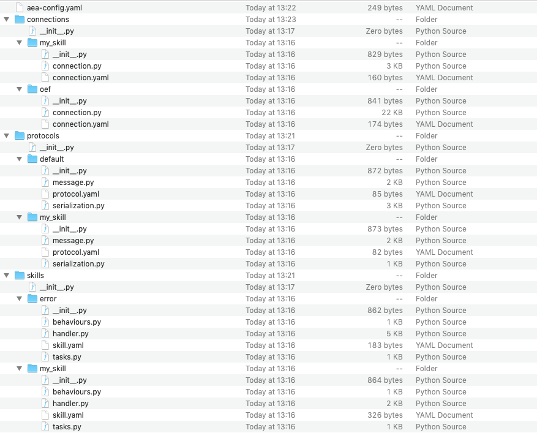

## Scaffold generator

The scaffold generator builds out the directory structure required when adding new skills, protocols, and connections to the agent.

For example, create a new AEA project.

``` bash
aea create my_agent
cd my_agent
```

Then, cd into your project directory and scaffold your project skill, protocol, or connection.

You will see the directories filled out with the files required and the skill, protocol, or connection registered in the top level `aea-config.yaml`.


### Scaffold a skill

``` bash
aea scaffold skill my_skill
```


### Scaffold a protocol

``` bash
aea scaffold protocol my_protocol
```


### Scaffold a connection

``` bash
aea scaffold connection my_connection
```

After running the above commands, you will have the fully constructed file system required by the AEA.

<center></center>


<br />