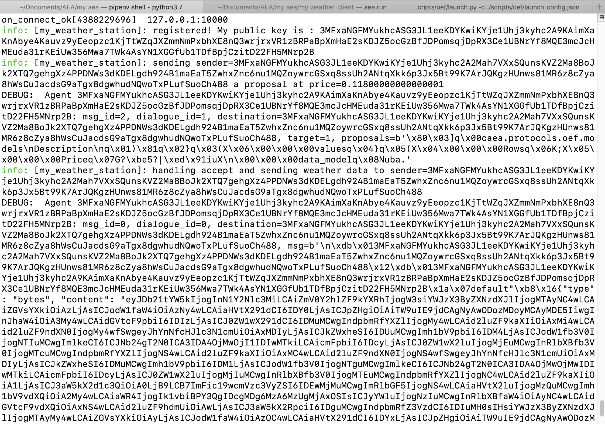
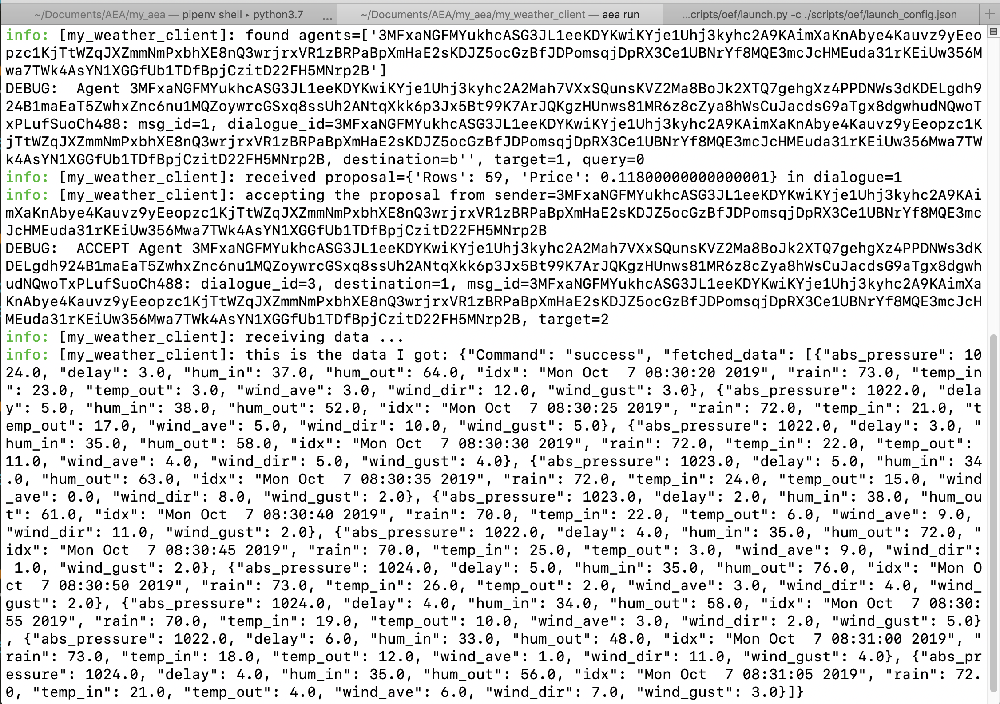

The AEA weather skills demonstrate an interaction between two AEAs.

* The provider of weather data (the weather station).
* The buyer of weather data (the weather client).

## Preparation instructions

### Dependencies

Follow the <a href="../quickstart/#preliminaries">Preliminaries</a> and <a href="../quickstart/#installation">Installation</a> sections from the AEA quick start.

##Discussion

The scope of the specific demo is to demonstrate how to create a simple AEA with the usage of the AEA framework and a database. The weather_station AEA
will read data from the database, that is populated with readings from a weather station, based on the requested dates and will deliver the data to the client upon payment.
This demo does not utilize a smart contract. As a result, we interact with a ledger only to complete a transaction.

You can use this AEA as an example of how to read data from a database and advertise these to possible clients.  

### Launch an OEF node

In a separate terminal, launch a local OEF node (for search and discovery).
``` bash
python scripts/oef/launch.py -c ./scripts/oef/launch_config.json
```

Keep it running for all the following demos.

## Demo instructions 1: no ledger payment

The AEAs negotiate and then transfer the data. No payment takes place. This demo serves as a demonstration of the negotiation steps.

### Create the weather station AEA
In the root directory, create the weather station AEA.
``` bash
aea create my_weather_station
```


### Add the oef connection and the weather station skill 
``` bash
cd my_weather_station
aea add connection fetchai/oef:0.1.0
aea add skill fetchai/weather_station:0.1.0
aea install
```


### Run the weather station AEA
``` bash
aea run --connections fetchai/oef:0.1.0
```


### Create the weather client AEA
In a new terminal window, return to the root directory and create the weather client AEA.
``` bash
aea create my_weather_client
```


### Add the oef connection and the weather client skill 
``` bash
cd my_weather_client
aea add connection fetchai/oef:0.1.0
aea add skill fetchai/weather_client:0.1.0
aea install
```


### Run the weather client AEA
``` bash
aea run --connections fetchai/oef:0.1.0
```


### Observe the logs of both AEAs

<center></center>

<center></center>

To stop an AEA use `CTRL + C`.

### Delete the AEAs

When you're done, go up a level and delete the AEAs.

``` bash
cd ..
aea delete my_weather_station
aea delete my_weather_client
```

## Communication
This diagram shows the communication between the various entities as data is successfully sold by the car park AEA to the client. 

<div class="mermaid">
    sequenceDiagram
        participant Search
        participant Client_AEA
        participant Weather_AEA
    
        activate Client_AEA
        activate Search
        activate Weather_AEA
        
        Weather_AEA->>Search: register_service
        Client_AEA->>Search: search
        Search-->>Client_AEA: list_of_agents
        Client_AEA->>Weather_AEA: call_for_proposal
        Weather_AEA->>Client_AEA: propose
        Client_AEA->>Weather_AEA: accept
        Weather_AEA->>Client_AEA: match_accept
        Client_AEA->>Weather_AEA: Inform funds transfered 
        Weather_AEA->>Client_AEA: send_data
        
        deactivate Client_AEA
        deactivate Search
        deactivate Weather_AEA
    
</div>
Note that the client informs the weather station that funds have been transfereed, but in this example no funds actually get transfered.

## Demo instructions 2: Ledger payment

A demo to run the same scenario but with a true ledger transaction on Fetch.ai `testnet` or Ethereum `ropsten` network. This demo assumes the buyer
trusts the seller AEA to send the data upon successful payment.

### Create the weather station (ledger version)

Create the AEA that will provide weather measurements.

``` bash
aea create my_weather_station
cd my_weather_station
aea add connection fetchai/oef:0.1.0
aea add skill fetchai/weather_station:0.1.0
aea install
```

### Create the weather client (ledger version)

In another terminal, create the AEA that will query the weather station.

``` bash
aea create my_weather_client
cd my_weather_client
aea add connection fetchai/oef:0.1.0
aea add skill fetchai/weather_client:0.1.0
aea install
```

Additionally, create the private key for the weather_client AEA based on the network you want to transact.

To generate and add a key for Fetch.ai use:
```bash
aea generate-key fetchai
aea add-key fetchai fet_private_key.txt
```

To generate and add a key for Ethereum use:
```bash
aea generate-key ethereum
aea add-key ethereum eth_private_key.txt
```

### Update the AEA configs

Both in `my_seller_aea/aea-config.yaml` and
`my_buyer_aea/aea-config.yaml`, replace `ledger_apis: {}` with the following based on the network you want to connect.

To connect to Fetch.ai:

``` yaml
ledger_apis:
  fetchai:
    network: testnet
```

To connect to Ethereum:
```yaml
ledger_apis:
  ethereum:
    address: https://ropsten.infura.io/v3/f00f7b3ba0e848ddbdc8941c527447fe
    chain_id: 3
    gas_price: 50
```
### Fund the weather client AEA

Create some wealth for your weather client  based on the network you want to transact with: 

On the Fetch.ai `testnet` network.
``` bash
aea generate-wealth fetchai
```

On the Ethereum `ropsten` . (It takes a while).
``` bash
aea generate-wealth ethereum
```

### Update the skill configs

In `my_weather_station/vendor/fetchai/weather_station/skill.yaml`, under strategy amend the `currency_id` and `ledger_id` as follows:

```bash
|----------------------------------------------------------------------|
|         FETCHAI                   |           ETHEREUM               |
|-----------------------------------|----------------------------------|
|models:                            |models:                           |              
|  strategy:                        |  strategy:                       |
|     class_name: Strategy          |     class_name: Strategy         |
|    args:                          |    args:                         |
|      date_one: "1/10/2019"        |      date_one: "1/10/2019"       |
|      date_two: "1/12/2019"        |      date_two: "1/12/2019"       |
|      price_per_row: 1             |      price_per_row: 1            |
|      seller_tx_fee: 0             |      seller_tx_fee: 0            |
|      currency_id: 'FET'           |      currency_id: 'ETH'          |
|      ledger_id: 'fetchai'         |      ledger_id: 'ethereum'       |
|      is_ledger_tx: True           |      is_ledger_tx: True          |
|----------------------------------------------------------------------| 
```

In the weather client skill config (`my_weather_client/skills/weather_client/skill.yaml`) under strategy change the `currency_id` and `ledger_id`.

```bash
|----------------------------------------------------------------------|
|         FETCHAI                   |           ETHEREUM               |
|-----------------------------------|----------------------------------|
|models:                            |models:                           |              
|  strategy:                        |  strategy:                       |
|     class_name: Strategy          |     class_name: Strategy         |
|    args:                          |    args:                         |
|      max_price: 4                 |      max_price: 40               |
|      max_buyer_tx_fee: 1          |      max_buyer_tx_fee: 200000    |
|      currency_id: 'FET'           |      currency_id: 'ETH'          |
|      ledger_id: 'fetchai'         |      ledger_id: 'ethereum'       |
|      is_ledger_tx: True           |      is_ledger_tx: True          |
|ledgers: ['fetchai']               |ledgers: ['ethereum']             |
|----------------------------------------------------------------------| 
```
An other way to update the skill config is via the `aea config get/set` command.
``` bash
aea config set vendor.fetchai.skills.weather_client.models.strategy.args.max_buyer_tx_fee 10000 --type int
aea config set vendor.fetchai.skills.weather_client.models.strategy.args.currency_id ETH
aea config set vendor.fetchai.skills.weather_client.models.strategy.args.ledger_id ethereum
aea config set vendor.fetchai.skills.weather_client.models.strategy.args.is_ledger_tx True --type bool
```

### Run the AEAs

Run both AEAs from their respective terminals.
``` bash
aea run --connections fetchai/oef:0.1.0
```

You will see that the AEAs negotiate and then transact using the Fetch.ai `testnet`.

### Delete the AEAs

When you're done, go up a level and delete the AEAs.

``` bash
cd ..
aea delete my_weather_station
aea delete my_weather_client
```

## Communication
This diagram shows the communication between the various entities as data is successfully sold by the weather station AEA to the client. 

<div class="mermaid">
    sequenceDiagram
        participant Search
        participant Client_AEA
        participant Weather_AEA
        participant Blockchain
    
        activate Client_AEA
        activate Search
        activate Weather_AEA
        activate Blockchain
        
        Weather_AEA->>Search: register_service
        Client_AEA->>Search: search
        Search-->>Client_AEA: list_of_agents
        Client_AEA->>Weather_AEA: call_for_proposal
        Weather_AEA->>Client_AEA: propose
        Client_AEA->>Weather_AEA: accept
        Weather_AEA->>Client_AEA: match_accept
        Client_AEA->>Blockchain: transfer_funds
        Client_AEA->>Weather_AEA: send_transaction_hash
        Weather_AEA->>Blockchain: check_transaction_status
        Weather_AEA->>Client_AEA: send_data
        
        deactivate Client_AEA
        deactivate Search
        deactivate Weather_AEA
        deactivate Blockchain
       
</div>
